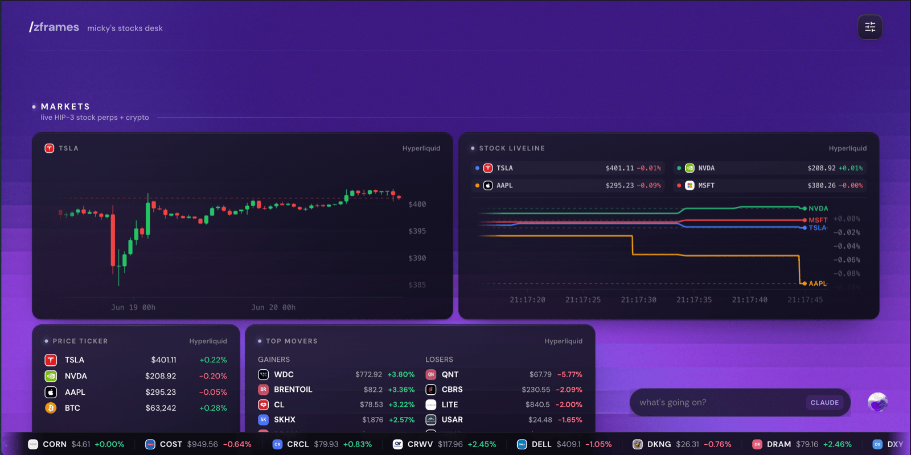

<p align="center">
  
</p>

<p align="center"><b>Describe your dashboard. An agent builds it. It gets sharper every day.</b></p>

<p align="center">
  <a href="LICENSE"></a>
  
  
  
  
</p>

zframes is a framework where **AI agents generate personal market terminals**. You don't clone a repo or build a Node project — you install a *skill* into your coding agent and describe the dashboard you want. The agent reads a catalogue of *frames* (typed, validated dashboard widgets), emits a plain-JSON `dashboard.json` spec, and the runtime renders it with live market data. Invalid specs fail per-frame with readable errors the agent uses to self-correct — the generation loop is built into the rendering contract, so the agent never writes a line of React.

<p align="center">
  
  <br>
  <sub><i>A generated zframes dashboard — every card is a validated frame fed by keyless public data.</i></sub>
</p>

### Why it's different

- 🗣️ **Agent-generated** — you talk; an agent writes the spec and runs it. No dashboard builder UI to learn.
- 🔑 **Keyless** — fifteen free public data sources (Hyperliquid, CoinGecko, DeFiLlama, Deribit, mempool.space, the U.S. Treasury, the NY Fed, BLS, SEC EDGAR, and more). No signup, no keys, no `.env`.
- 📈 **Stocks first** — live equity perps stream via Hyperliquid HIP-3 (`xyz:TSLA`, `xyz:NVDA`), with crypto, DeFi, derivatives, and official US macro data alongside.
- 🧩 **Yours to own** — your dashboard is one git-trackable `dashboard.json`; the CLI serves it locally. No hosted service, no lock-in.
- 🧠 **Self-improving** — a daily loop grades yesterday's market calls against what actually happened and writes a fresh brief into your dashboard.

---

## Quickstart — install the skill, then talk

You drive zframes from your coding agent, not from a Node project you build by hand. Open your agent, install the skill once, and describe what you want — the agent absorbs the setup: it writes your `dashboard.json` and serves it.

### 1. Install the skill

```bash
npx skills add zentryhq/zframes
```

That pulls the [`zframes`](skills/zframes/SKILL.md) and [`zframes-brief`](skills/zframes-brief/SKILL.md) skills from this repo into your agent's skills directory (for Claude Code, `~/.claude/skills/`). One command, no clone, no per-package install — it works with any agent that supports the open skills standard.

### Supported agents

The skills are plain Markdown following the [skills standard](https://github.com/obra/skills), so any skills-aware coding agent can run them. Install is the same `npx skills add zentryhq/zframes` everywhere; only how you summon the skill differs.

| Agent | Summon it by | Status |
|---|---|---|
| **Claude Code** (Anthropic) | `/zframes build me a TSLA terminal` | ✅ Primary — tested end-to-end |
| **Cursor** | mention **zframes** in chat | ✓ Compatible (skills standard) |
| **Gemini CLI** (Google) | mention **zframes** in chat | ✓ Compatible (skills standard) |
| **Codex** (OpenAI) | mention **zframes** in chat | ✓ Compatible (skills standard) |
| Any other skills-aware agent | reads `skills/` per the open standard | ⚙️ Should work |

### 2. Then just talk

```
"/zframes build me a TSLA + NVDA terminal with funding and fear-greed"
```

```
  → agent reads the frame catalogue  (zframes catalogue)
  → agent writes dashboard.json and lints it  (zframes lint)
  → agent serves it live and opens the browser  (zframes serve)
```

The contract the agent works against is the **catalogue** (frame names + config schemas) and the **linter** (per-frame validation feedback). It only ever emits JSON — the framework owns all rendering.

### What the two skills do

| Skill | What it does | You say |
|---|---|---|
| [**`zframes`**](skills/zframes/SKILL.md) | Builds & edits your dashboard — reads the catalogue, writes `dashboard.json`, lints it, serves it live in your browser. | *"build me a TSLA + NVDA terminal"* |
| [**`zframes-brief`**](skills/zframes-brief/SKILL.md) | Daily analyst loop — analyzes the symbols on your dashboard, grades yesterday's calls, writes today's brief into the `daily-analysis` frame. | *"run my daily brief"* |

> `npx skills add zentryhq/zframes` installs the skills into any skills-aware agent. The [`zframes`](https://www.npmjs.com/package/zframes) **CLI** they drive is published on npm and bundles the dashboard runtime, so `npx zframes serve` fetches the whole runtime on each run — no clone, no install.

---

## Concepts

- **Frame** — `defineFrame({ name, description, capabilities, schema, component })`. The Zod schema (every field `.describe()`d) doubles as the AI-facing API: `catalogueForAI(registry)` exports it as JSON Schema for generating agents. Frame *metadata* ([`packages/frames/src/schemas.ts`](packages/frames/src/schemas.ts)) is React-free, so tooling reads it without pulling in charts or CSS.
- **Dashboard spec** — `dashboard.json`: version, title, grid, background, and frame instances with positions and configs. Diffable, git-friendly, agent-writable, human-editable.
- **Provider** — fulfills frame *capabilities* (`quote-stream`, `day-stats`, `ohlcv`, `tvl`, `sentiment`, `global-market`, …). The host registers providers; the runtime routes each frame's data needs to the first provider that covers them. A frame whose capability no provider covers renders as an error card — never a silently-empty widget.
- **Background** — the spec *declares* the background (`gradient` | `unicorn` | `none`); the host *renders* it. Same split as providers, keeping the heavy animated engine out of the spec and the React-free tooling path.

---

## Frame catalogue

Over 70 built-in frames ([`packages/frames`](packages/frames)), grouped into 12 categories. Each frame's Zod schema is the AI-facing API, so the live, authoritative list is whatever `zframes catalogue` prints — never a hand-kept table. The families:

| Category | Frames include |
|---|---|
| **Prices & Markets** | `price-chart`, `price-liveline`, `price-ticker`, `top-movers`, `price-compare` |
| **Crypto & On-chain** | `bitcoin-dominance`, `market-cap-treemap`, `tvl-treemap`, `dex-volume-*`, `protocol-tvl-*`, `protocol-fees-treemap`, `coin-movers` |
| **Bitcoin Network** | `btc-fees`, `btc-mempool`, `btc-blocks`, `btc-hashrate`, `btc-difficulty`, `mining-pools`, `lightning-stats` |
| **Derivatives & Options** | `funding-rate-chart`, `funding-heatmap`, `open-interest`, `options-put-call`, `options-iv`, `options-oi-strike` |
| **Macro & Rates** | `rates-board`, `yield-curve`, `inflation-pulse`, `labor-market`, `national-debt`, `treasury-auctions`, `financial-stress`, `fx-board` |
| **Equities & Filings** | `fundamentals`, `filings-feed`, `short-volume` |
| **Sentiment & News** | `fear-greed`, `news-feed` |
| **Portfolio** | `portfolio-value`, `portfolio-allocation`, `portfolio-holdings` |
| **Decision Journal** | `journal-log`, `journal-open`, `journal-results`, `journal-score` |
| **Tools & Utility** | `daily-analysis` (the daily brief), `clock`, `countdown`, `calculator`, `link-grid`, `market-hours`, `checklist` |
| **Layout & Media** | `heading`, `divider`, `note`, `image`, `video`, `quote` |
| **Games** | `dino-game`, `snake`, `flappy-bird`, `drawdy`, `dice` |

Stocks are the lead use case — equity perps via Hyperliquid HIP-3 builder dexes, namespaced by Hyperliquid itself (`xyz:TSLA`, `xyz:NVDA`, `km:US500`) over the same free WebSocket, no extra adapter. Crypto (`BTC`, `ETH`) works identically.

---

## Providers

Fifteen free, keyless providers ([`packages/provider-*`](packages)) fulfil frame capabilities:

| Provider | Covers |
|---|---|
| **Hyperliquid** | `quote-stream`, `day-stats`, `funding-history`, `ohlcv`, `open-interest` — crypto + HIP-3 stock perps |
| **CoinGecko** (free tier) | `global-market` (marketcap + dominance), `coin-markets` |
| **Coinpaprika** | `coin-movers` across ~2000 coins |
| **alternative.me** | `sentiment` (Fear & Greed) |
| **DeFiLlama** | `tvl`, `dex-volume`, `protocol-tvl`, `protocol-fees` |
| **mempool.space** | Bitcoin fees, mempool, blocks, hashrate, difficulty, mining pools, Lightning |
| **Deribit** | put-call ratio, OI-by-strike, DVOL volatility index |
| **U.S. Treasury** | average interest rates, debt-to-penny, auctions, daily yield curve |
| **NY Fed** | SOFR, EFFR, repo reference rates |
| **OFR** | `financial-stress` index |
| **BLS** | CPI, unemployment, and other public time series |
| **FINRA** | `short-volume` (daily reported short-sale volume) |
| **SEC EDGAR** | company filings + XBRL fundamentals |
| **News (RSS)** | `news` headlines from public outlet feeds |
| **Frankfurter / ECB** | `fx-rates` (daily reference FX rates) |

Official US sources (Treasury, NY Fed, OFR, BLS, FINRA, SEC) are keyless but CORS-blocked in the browser, so the runtime relays them through a same-origin allowlisted proxy.

An **opt-in keyed tier** (a connected **Binance** account and a public on-chain **wallet** address, both `portfolio`) also exists, but it's separate from the keyless set and **not wired into the published CLI**.

---

## The daily brief loop

The `zframes-brief` skill turns the terminal into something that learns. On each run (manually or on a schedule) it:

1. reads the symbols already on your `dashboard.json`,
2. pulls a keyless market snapshot for them (`zframes snapshot`, the deterministic half),
3. **grades yesterday's calls** against what the market actually did, tracking a running hit-rate,
4. writes today's analysis + a few fresh, checkable calls, and appends it to one log file.

The `daily-analysis` frame renders that log on the dashboard. The loop **only** writes the analysis log — it never edits `dashboard.json`. See [`docs/specs/daily-brief-flow.html`](docs/specs/daily-brief-flow.html).

---

## Run it from source

You don't need this to *use* zframes — the agent flow above handles everything. But the repo runs standalone if you want to hack on the framework, inspect the runtime, or drive the CLI by hand.

```bash
pnpm install
pnpm dev          # runtime at http://localhost:37263
```

The runtime streams real prices from Hyperliquid's public WebSocket and renders a `dashboard.json` — resolved the same way `zframes serve` resolves it (your global-store default, else a local `./dashboard.json`). Edit that file — by hand or with your agent — and it hot-reloads. You can also drag, resize, and add frames right in the browser; **Save** writes the changes back to the same file.

```bash
pnpm typecheck    # tsc across all packages
pnpm build        # production build of the runtime
```

### CLI

The skill drives this CLI; you can run the same commands yourself.

```bash
pnpm build:cli                      # build the bin (also builds the prebuilt runtime serve ships)
pnpm zframes init [name|dir]        # write a bare, valid dashboard.json envelope for the agent to fill
pnpm zframes catalogue              # frame catalogue as JSON Schema (what the agent reads)
pnpm zframes lint <name|file>       # validate a spec; exit 1 with readable, per-frame errors
pnpm zframes snapshot [name|file]   # keyless market snapshot of the spec's symbols (feeds the brief)
pnpm zframes serve [name|file]      # serve a dashboard as a live, editable terminal (:37263)
pnpm zframes list                   # list dashboards in the global store
pnpm zframes use <name>             # set the default store dashboard
```

A dashboard is one `dashboard.json`. Point at a file, or name one and it lives in your global store (`$XDG_CONFIG_HOME/zframes`, default `~/.config/zframes`) so the CLI runs from anywhere and holds many. `zframes serve` hosts a prebuilt dashboard runtime pointed at it (bound to `127.0.0.1`), with in-browser editing that saves back to the file — you own just that one file, no app to maintain. The CLI is [published on npm](https://www.npmjs.com/package/zframes), so the agent runs `npx zframes serve` per run without a clone.

---

## Repository layout

```
packages/
  core                     frame primitives, spec schema, renderer, editor, provider hooks, catalogue
  charts                   D3 base chart layer (ported from zTerminal) + theme tokens
  frames                   the built-in frames + their AI-facing schemas
  provider-*               15 keyless data providers (Hyperliquid, CoinGecko, DeFiLlama,
                           Deribit, mempool, Treasury, NY Fed, OFR, BLS, FINRA, SEC, …)
                           + 2 opt-in keyed providers (binance, wallet)
  cli                      zframes init | serve | list | use | catalogue | lint | snapshot
apps/runtime               Vite app that renders a dashboard.json (editable in-browser)
skills/zframes             the build-my-dashboard skill
skills/zframes-brief       the daily-analyst loop skill
```

Packages ship TypeScript source (`main: src/index.ts`); the runtime's Vite consumes them directly. pnpm only.

---

## License

[Apache-2.0](LICENSE) · Copyright 2026 Zentry. See [`NOTICE`](NOTICE) for third-party components (liveline, d3, the Unicorn Studio engine). Distribution is `npx zframes serve` — one [published](https://www.npmjs.com/package/zframes) CLI that bundles the runtime, pointed at your `dashboard.json`.
