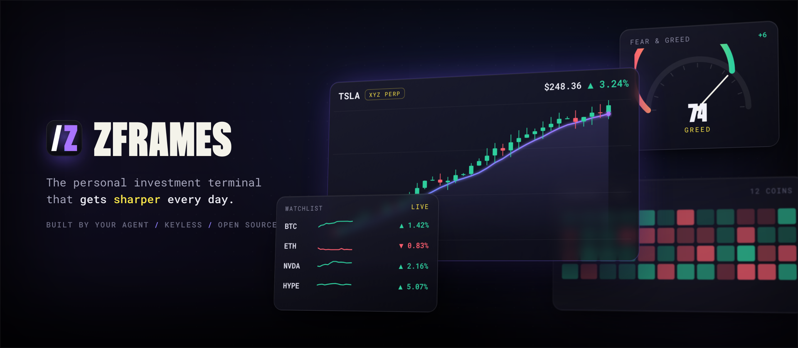
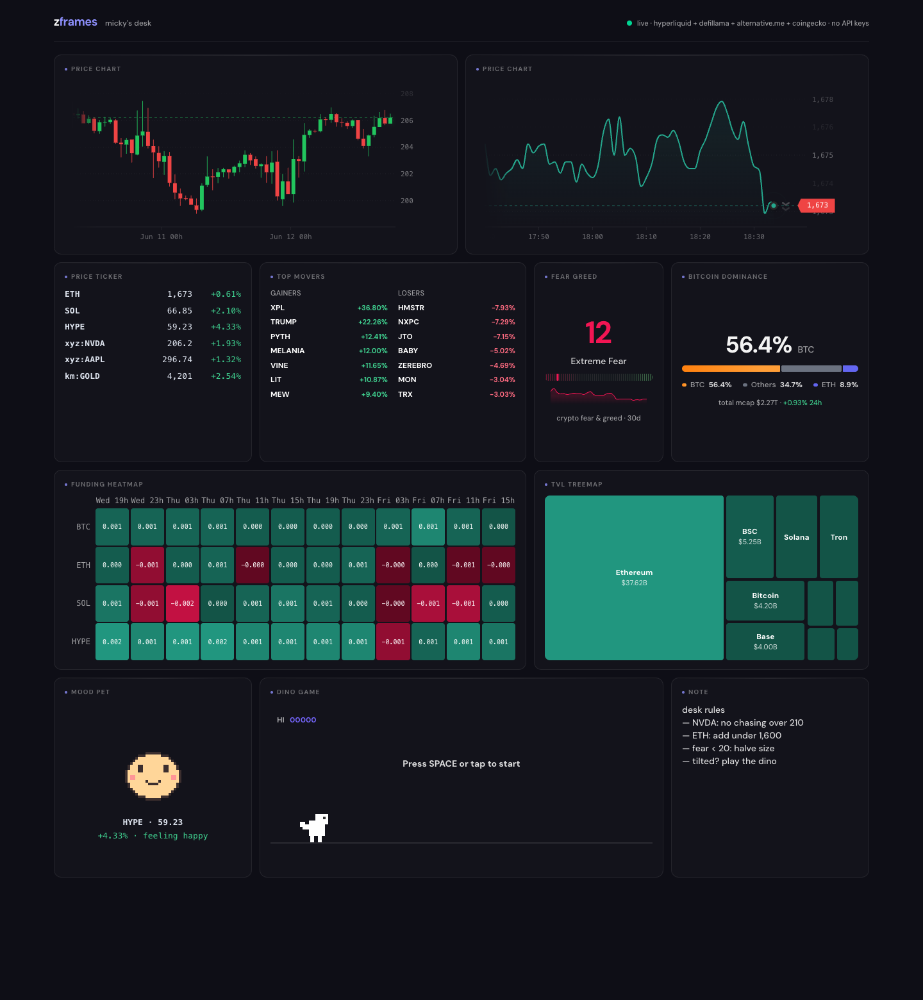

<p align="center">
  
</p>

<p align="center"><b>Describe your dashboard. An agent builds it. It gets smarter every day.</b></p>

<p align="center">
  <a href="LICENSE"></a>
  
  
  
  
</p>

zframes is a framework where **AI agents generate personal market terminals**. The agent reads a catalogue of *frames* (typed, validated dashboard widgets), emits a plain-JSON `dashboard.json` spec, and the runtime renders it with live market data. Invalid specs fail per-frame with readable errors the agent uses to self-correct — the generation loop is built into the rendering contract, so the agent never writes a line of React.

<p align="center">
  
  <br>
  <sub><i>A generated zframes dashboard — every card is a validated frame fed by keyless public data.</i></sub>
</p>

### Why it's different

- 🗣️ **Agent-generated** — you talk; an agent writes the spec and runs it. No dashboard builder UI to learn.
- 🔑 **Keyless** — Hyperliquid, DeFiLlama, alternative.me, and CoinGecko free public APIs. No signup, no keys, no `.env`.
- 📈 **Stocks first** — live equity perps stream via Hyperliquid HIP-3 (`xyz:TSLA`, `xyz:NVDA`), with crypto, TVL, and sentiment alongside.
- 🧩 **Yours to own** — the agent scaffolds a real, git-trackable Vite app on your machine. No hosted service, no lock-in.
- 🧠 **Self-improving** — a daily loop grades yesterday's market calls against what actually happened and writes a fresh brief into your dashboard.

---

## See it running

```bash
pnpm install
pnpm dev          # playground at http://localhost:5179
```

The playground streams real prices from Hyperliquid's public WebSocket and renders the dashboard in [`apps/playground/src/dashboard.json`](apps/playground/src/dashboard.json). Edit that file — by hand or with your agent — and it hot-reloads. You can also drag, resize, and add frames right in the browser; **Save** writes the changes back to the same `dashboard.json`.

```bash
pnpm typecheck    # tsc across all packages
pnpm build        # production build of the playground
```

---

## Use it with your agent

zframes is built to be driven by a coding agent (Claude Code, Cursor, …). Two skills ship in [`skills/`](skills/):

| Skill | What it does | You say |
|---|---|---|
| [**`zframes`**](skills/zframes/SKILL.md) | Builds & edits your dashboard — scaffolds a real app, reads the catalogue, writes `dashboard.json`, lints it, opens the browser. | *"build me a TSLA + NVDA terminal"* |
| [**`zframes-brief`**](skills/zframes-brief/SKILL.md) | Daily analyst loop — analyzes the symbols on your dashboard, grades yesterday's calls, writes today's brief into the `daily-analysis` frame. | *"run my daily brief"* |

### 1. Install the skill (Claude Code)

Until the skill is published to npm, copy it into your skills directory:

```bash
git clone https://github.com/zentry/zframes.git
cp -r zframes/skills/zframes        ~/.claude/skills/
cp -r zframes/skills/zframes-brief  ~/.claude/skills/   # optional: the daily loop
```

### 2. Then just talk

```
"/zframes build me a TSLA + NVDA terminal with funding and fear-greed"
```

```
  → agent scaffolds a real Vite app  (zframes init)
  → agent reads the frame catalogue  (zframes catalogue)
  → agent writes dashboard.json and lints it  (zframes lint)
  → agent runs pnpm dev and opens the browser
```

The contract the agent works against is the **catalogue** (frame names + config schemas) and the **linter** (per-frame validation feedback). It only ever emits JSON — the framework owns all rendering.

> **Roadmap:** once the CLI and skill ship to npm, install becomes `npx skills add zframes` and the agent calls `npx zframes` instead of the in-repo CLI — same conversation, no clone needed. See [`docs/deployment-plan.html`](docs/deployment-plan.html).

---

## Concepts

- **Frame** — `defineFrame({ name, description, capabilities, schema, component })`. The Zod schema (every field `.describe()`d) doubles as the AI-facing API: `catalogueForAI(registry)` exports it as JSON Schema for generating agents. Frame *metadata* ([`packages/frames/src/schemas.ts`](packages/frames/src/schemas.ts)) is React-free, so tooling reads it without pulling in charts or CSS.
- **Dashboard spec** — `dashboard.json`: version, title, grid, background, and frame instances with positions and configs. Diffable, git-friendly, agent-writable, human-editable.
- **Provider** — fulfills frame *capabilities* (`quote-stream`, `day-stats`, `ohlcv`, `tvl`, `sentiment`, `global-market`, …). The host registers providers; the runtime routes each frame's data needs to the first provider that covers them. A frame whose capability no provider covers renders as an error card — never a silently-empty widget.
- **Background** — the spec *declares* the background (`gradient` | `unicorn` | `none`); the host *renders* it. Same split as providers, keeping the heavy animated engine out of the spec and the React-free tooling path.

---

## Frame catalogue

Thirteen built-in frames ([`packages/frames`](packages/frames)):

| Frame | What it shows |
|---|---|
| `price-chart` | Live candle/line chart for one symbol (liveline) — HIP-3 stock perps + crypto |
| `price-ticker` | Streaming watchlist with 24h change |
| `top-movers` | Biggest gainers/losers across the perp universe |
| `funding-rate-chart` | Multi-series funding rates across coins |
| `funding-heatmap` | Funding rates as a coins × time heatmap |
| `tvl-treemap` | Total value locked per chain (DeFiLlama) |
| `fear-greed` | Crypto Fear & Greed index with sparkline |
| `bitcoin-dominance` | BTC / ETH / Others dominance bar |
| `daily-analysis` | The daily brief — dated analysis + scored calls, written by the `zframes-brief` loop |
| `note` | Free-form pinned text (trading plan, reminders) |
| `image` | Image from a URL |
| `heading` | Section divider to group frames into zones |
| `dino-game` | Chrome-dino runner, for when the market's flat |

Stocks are the lead use case — equity perps via Hyperliquid HIP-3 builder dexes, namespaced by Hyperliquid itself (`xyz:TSLA`, `xyz:NVDA`, `km:US500`) over the same free WebSocket, no extra adapter. Crypto (`BTC`, `ETH`) works identically.

---

## Providers

All free, all keyless ([`packages/provider-*`](packages)):

| Provider | Capabilities |
|---|---|
| **Hyperliquid** | `quote-stream`, `day-stats`, `funding-history`, `ohlcv` — crypto + HIP-3 stock perps |
| **DeFiLlama** | `tvl` |
| **alternative.me** | `sentiment` (Fear & Greed) |
| **CoinGecko** (free tier) | `global-market` (total marketcap + dominance) |

---

## The daily brief loop

The `zframes-brief` skill turns the terminal into something that learns. On each run (manually or on a schedule) it:

1. reads the symbols already on your `dashboard.json`,
2. pulls a keyless market snapshot for them (`zframes snapshot`, the deterministic half),
3. **grades yesterday's calls** against what the market actually did, tracking a running hit-rate,
4. writes today's analysis + a few fresh, checkable calls, and appends it to one log file.

The `daily-analysis` frame renders that log on the dashboard. The loop **only** writes the analysis log — it never edits `dashboard.json`. See [`docs/daily-brief-flow.html`](docs/daily-brief-flow.html).

---

## CLI

```bash
pnpm build:cli                      # build the bin (also vendors the scaffold template)
pnpm zframes catalogue              # frame catalogue as JSON Schema (what the agent reads)
pnpm zframes lint <dashboard.json>  # validate a spec; exit 1 with readable, per-frame errors
pnpm zframes snapshot <dashboard.json>   # keyless market snapshot of the spec's symbols (feeds the brief)
pnpm zframes init [dir]             # scaffold a full, runnable dashboard app
pnpm zframes init --json [file]     # write just a starter dashboard.json
```

`zframes init` scaffolds a complete, owned Vite app with the runtime vendored in — it runs without cloning this repo or installing anything from a registry. (Publishing the CLI and skill to npm is on the roadmap; see [`docs/deployment-plan.html`](docs/deployment-plan.html).)

---

## Repository layout

```
packages/
  core                     frame primitives, spec schema, renderer, editor, provider hooks, catalogue
  charts                   D3 base chart layer (ported from zTerminal) + theme tokens
  frames                   the 13 built-in frames + their AI-facing schemas
  provider-hyperliquid     keyless live market data (crypto + HIP-3 stocks)
  provider-defillama       TVL
  provider-alternativeme   Fear & Greed
  provider-coingecko       global market / dominance
  cli                      zframes catalogue | lint | snapshot | init
apps/playground            Vite demo that renders src/dashboard.json (editable in-browser)
skills/zframes             the build-my-dashboard skill
skills/zframes-brief       the daily-analyst loop skill
```

Packages ship TypeScript source (`main: src/index.ts`); the playground's Vite consumes them directly. pnpm only.

---

## License

[Apache-2.0](LICENSE) · Copyright 2026 Zentry. See [`NOTICE`](NOTICE) for third-party components (liveline, d3, unicornstudio-react). The runtime packages are not yet published to npm — distribution today is the `zframes init` scaffold (see [`docs/deployment-plan.html`](docs/deployment-plan.html)).
